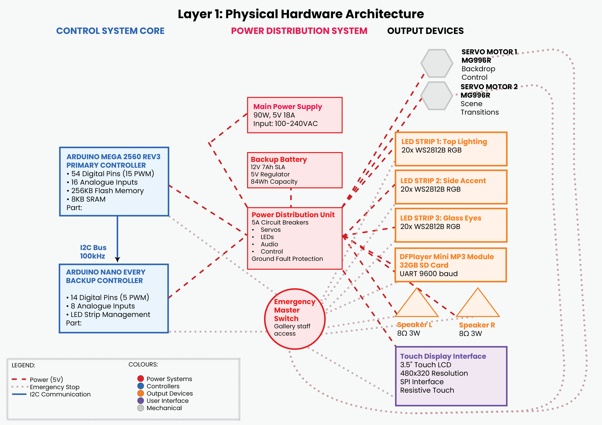

# Technical Architecture
## Overview

This document details the technical architecture for the Scattered Gazes Arduino-controlled interactive installation. It covers all major system components, automation flow, hardware specifications, wiring, firmware design, safety protocols, and integration points needed for reliable operation and future development.

## System Components

**Main Controller:** Arduino Uno Rev3 (or Mega for extended IO)

**Scene Automation:** Dual SG90 or MG996R servo motors for backdrop transitions?

**Lighting:** WS2812B addressable LED strips (60 LEDs, 3 zones)

**User Interface:** resistive touch LCD display

**Audio System:** DFPlayer Mini MP3 module with 3W speaker output

**Sensors**: HC-SR04 proximity, DHT22 temperature/humidity, GL5537 photoresistor, KY-038 microphone(?)

**Power:** 5V 3A switching supply, backup battery, relay-based emergency cutoff

## System Architecture Diagram

Layer 1

Layer 2

## Hardware Setup

## Firmware Structure

## Automation Flowcharts

*The flowchart below outlines the main automation states, decision branches, and system reset logic for the Scattered Gazes installation. Detailed scene contents are abstracted to preserve artistic confidentiality at this stage.*

*Each block represents 6–10 discrete automation triggers (servo, audio, LED, display updates), mapped to the script sections. Further breakdown will be provided post-exhibition.*

## Communication Protocols

to be added

## Safety & Compliance

to be added

## Upgrades & Expansion (For Future Use)

to be added

## References & Links

to be added
